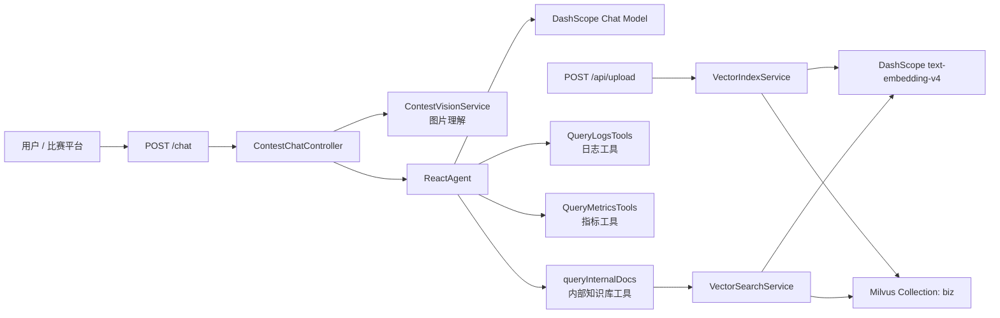

# 智能 OnCall Agent 技术文档

## 1. 项目概述

智能 OnCall Agent 面向客服、售后和运维值班场景，目标是把常见 FAQ、售后流程、故障排查手册、日志指标说明、告警处理流程和截图信息统一接入到一个可对话的智能体中。

系统不是单纯聊天机器人，而是一个具备以下能力的智能体：

- 能接收用户自然语言问题。
- 能调用知识库检索工具进行 RAG 问答。
- 能调用监控、日志、时间等工具辅助诊断。
- 能接收图片输入，并通过视觉模型提取截图关键信息。
- 能维护会话上下文，支持连续追问。
- 能通过标准 `/chat` 接口对接比赛平台或外部评测系统。

## 2. 技术架构

## 3. 核心模块

| 模块 | 文件 | 作用 |
| --- | --- | --- |
| 比赛接口 | `ContestChatController.java` | 提供 `/chat`，完成鉴权、会话、视觉和 Agent 调用 |
| 视觉理解 | `ContestVisionService.java` | 使用 DashScope OpenAI 兼容接口调用 `qwen3.7-plus` |
| 会话管理 | `ContestSessionService.java` | 基于 `session_id` 保存多轮上下文 |
| Agent 封装 | `ChatService.java` | 创建 DashScope ChatModel 和 ReactAgent |
| 内部文档工具 | `InternalDocsTools.java` | 为 Agent 提供 `queryInternalDocs` 工具 |
| 文件上传 | `FileUploadController.java` | 提供 `/api/upload` 上传知识库文档 |
| 向量索引 | `VectorIndexService.java` | 文档分片、Embedding、写入 Milvus |
| 向量检索 | `VectorSearchService.java` | 根据问题生成向量并检索相似片段 |
| RAG 调试 | `RagDebugController.java` | 提供 `/api/rag/search` 直接查看召回结果 |

## 4. RAG 方案

知识库资料位于 `contest-materials/knowledge-base/`，当前包含：

- `faq_customer_support.md`：客服 FAQ。
- `after_sales_policy.md`：售后工单优先级、SLA 和升级策略。
- `payment_order_runbook.md`：支付成功但订单异常排查手册。
- `ops_alert_playbook.md`：CPU、内存、ServiceUnavailable、SlowResponse 告警处理。
- `logs_metrics_guide.md`：日志字段、指标含义和排查关键词。
- `image_ticket_triage.md`：图片工单和截图字段提取规范。
- `product_support_overview.md`：产品定位和智能体能力说明。

上传流程：

1. 管理者通过 `/api/upload` 上传 Markdown 或 TXT 文件。
2. 后端读取文件并按标题、段落和长度进行分片。
3. 使用 DashScope `text-embedding-v4` 生成 1024 维向量。
4. 写入 Milvus `biz` Collection。
5. 用户提问时，Agent 通过 `queryInternalDocs` 搜索相关片段。
6. 大模型基于召回片段生成可执行答案。

## 5. 多模态方案

比赛接口支持 `images` 字段，允许传入 Base64 或 `data:image/...;base64,...` 格式图片。

处理流程：

1. 校验图片数量，默认最多 3 张。
2. 校验图片体积，默认单张不超过 5 MB。
3. 调用 DashScope OpenAI 兼容模式接口。
4. 使用 `qwen3.7-plus` 提取截图、告警图、日志图、支付凭证图中的关键信息。
5. 将图片观察结果与原始问题一起交给 ReactAgent。
6. Agent 再结合知识库和工具给出最终答案。

## 6. 智能体能力边界

当前项目适合展示：

- 客服 FAQ 自动问答。
- 售后工单分级和升级建议。
- 支付成功但订单未同步排查。
- 运维告警标准处置流程。
- 日志字段解释和排查关键词推荐。
- 支付截图、告警截图、日志截图的信息提取。

当前项目不直接执行生产变更操作，例如自动退款、自动扩容、自动删除资源。涉及真实生产变更时，智能体应给出建议和操作清单，由人工确认执行。

## 7. 可继续优化方向

- 增加前端知识库管理页面，展示已上传文件和检索命中片段。
- 增加离线评测脚本，自动跑完 `rag_test_cases.csv` 并生成评分。
- 为 `/chat` 增加流式返回模式。
- 增加真实 Prometheus 和日志平台对接配置。
- 增加工单系统 API，把最终答案转为工单摘要、优先级和处理建议。
- 增加知识库版本号和文档来源字段，便于答辩时说明可追溯性。
